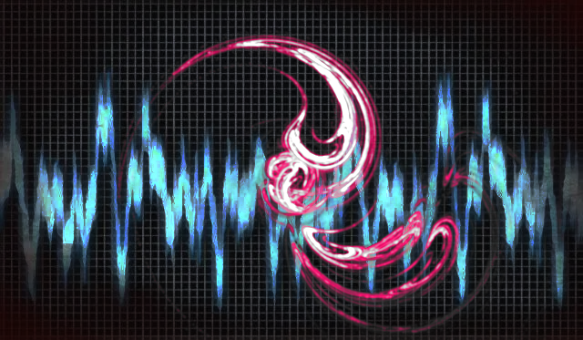

# CaptchaAudio: An audio captcha generator for alphanumeric sequences

## Date

5 Feb 2025



## Table Of Contents
- [CaptchaAudio: An audio captcha generator for alphanumeric sequences](#captchaaudio-an-audio-captcha-generator-for-alphanumeric-sequences)
  - [Date](#date)
  - [Table Of Contents](#table-of-contents)
  - [Overview](#overview)
  - [Cool, but how do I run it?](#cool-but-how-do-i-run-it)
    - [Initial Installations](#initial-installations)
    - [Command Summary](#command-summary)
    - [Help to run the project](#help-to-run-the-project)
    - [How to produce a captcha wav file for input sequence `123ABC`](#how-to-produce-a-captcha-wav-file-for-input-sequence-123abc)
  - [A work in progress](#a-work-in-progress)

## Overview

Captcha audio sounds are crucial for security reasons because they offer an alternative means of verifying human users for those who are visually impaired or unable to interact with traditional image-based captchas. This feature ensures that security measures remain inclusive while preventing automated bots from bypassing verification processes. Audio captchas often contain distorted speech or noise that bots struggle to interpret, which makes them a reliable tool for preventing malicious activities like automated account creation, form submissions, or brute-force attacks. By providing both visual and auditory options, captcha systems enhance accessibility and reinforce the overall integrity of online security.

This project produces wav files of distorted sound resulting from alpha-numeric user input. The project is to demonstrate how distortion may be used in security applications. Inspiration for this project was from https://github.com/dchest/captcha

## Cool, but how do I run it?

### Initial Installations

After cloning this repository to your computer, please complete the following installations, if not done previously, before starting the work on the assignment:

- Install Python. Please see:
  - [Setting Up Python on Windows](https://realpython.com/lessons/python-windows-setup/)
  - [Python 3 Installation and Setup Guide](https://realpython.com/installing-python/)
  - [How to Install Python 3 and Set Up a Local Programming Environment on Windows 10](https://www.digitalocean.com/community/tutorials/how-to-install-python-3-and-set-up-a-local-programming-environment-on-windows-10)
  - [Install Poetry](https://python-poetry.org/docs/#installation)

### Command Summary

-  The whole project was written in poetry. To engage poetry initially, use the following command from the root of the project. Note: the *root of the project* is the directory where the file, `pyproject.toml` resides.

``` bash
poetry install
```

If you have an error about the `lock` file, try the following command to reset `poetry.lock` for the project.

``` bash
poetry lock
```

Below are commands to run BeagleTM2 using a Docker container which houses all necessary libraries and software for BeagleTM.

### Help to run the project

``` bash
poetry run captchaaudio --help
```

### How to produce a captcha wav file for input sequence `123ABC`

``` bash
poetry run captchaaudio --captext "123ABC"
```

Note: all output is saved in the directory `0_out/`.

## A work in progress

Check back often to see the evolution of the project!! If you would like to contribute to this project, __then please do!__ For instance, if you see some low-hanging fruit or task that you could easily complete, that could add value to the project, then I would love to have your insight.

Otherwise, please create an Issue for bugs or errors. Since I am a teaching faculty member at Allegheny College, I may not have all the time necessary to quickly fix the bugs and so I would be very happy to have any help that I can get from the OpenSource community for any technological insight. Much thanks in advance. I hope that this project helps you find the knowledge from PubMed that you require for your project. :-)
